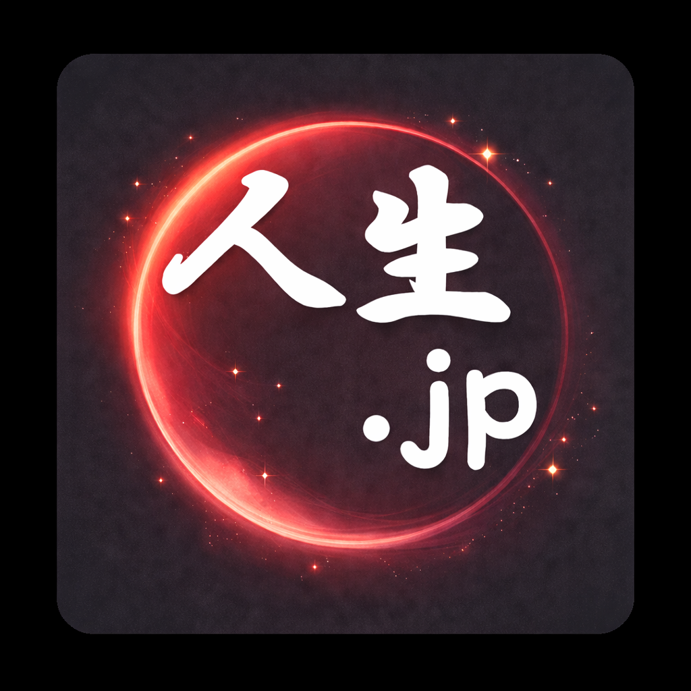

# 🗾 人生.jp



生年月日から日本の人生イベントを一覧表示するiOSアプリ。

## 機能

- 👥 複数人の登録・管理（AsyncStorageで端末内に永続化）
- 📅 ライフイベント年表（子ども / 学校 / 成人 / 長寿）カテゴリフィルター付き
- 🎑 七五三・厄年・参政権・運転免許など性別対応イベント
- 🗓 全イベントに和暦（令和・平成・昭和…）を表示
- 🔮 今日の運勢（ラッキーアイテム・カラー・ナンバー）

## セットアップ

```bash
npm install
npx expo start
```

Expo Go アプリ（iOS）でQRコードを読み込むと実機確認できます。

## App Store 公開（EAS Build）

```bash
npm install -g eas-cli
eas login
eas build:configure
eas build --platform ios
eas submit --platform ios
```

## プロジェクト構成

```
jinsei-jp/
├── app/
│   ├── _layout.tsx        # Expo Router レイアウト
│   └── index.tsx          # メイン画面
├── src/
│   ├── utils/
│   │   ├── calendar.ts    # 和暦・干支・星座
│   │   ├── colors.ts      # カラー定数
│   │   ├── events.ts      # ライフイベント生成
│   │   ├── fortune.ts     # 運勢ロジック
│   │   └── storage.ts     # AsyncStorage管理
│   ├── components/
│   │   └── TimelineRow.tsx
│   └── screens/
│       ├── AddPersonScreen.tsx
│       ├── EventsScreen.tsx
│       └── FortuneScreen.tsx
└── assets/                # アイコン・スプラッシュ
```

## 今後の拡張アイデア

- [ ] プッシュ通知（誕生日・七五三などのリマインダー）
- [ ] カレンダーアプリ連携
- [ ] App Store 公開（EAS Build）
